# 🦷 AI-Based Detection of MB2 Canal in CBCT Images

> **A Deep Learning Framework for Detection, Localization, and Segmentation of Mesiobuccal Root Canals in Cone-Beam Computed Tomography**

<div align="center">


</div>

---

## 📋 Table of Contents

- [📖 Overview](#-overview)
- [🎯 Objectives](#-objectives)
- [📊 Methodology](#-methodology)
  - [Data Pipeline](#data-pipeline)
  - [Dataset Characteristics](#dataset-characteristics)
  - [Preprocessing Steps](#preprocessing-steps)
  - [Model Architectures](#model-architectures)
  - [Evaluation Metrics](#evaluation-metrics)
- [📈 Results](#-results)
  - [Model Performance Comparison] 
  - [Confusion Matrices](#confusion-matrices)
  - [Training Curves](#training-curves)
  - [Visual Results](#visual-results)
  - [Cross-Validation Results](#cross-validation-results)
  - [Statistical Analysis](#statistical-analysis)
- [🔬 Key Findings](#-key-findings)
- [🛠️ Installation](#-installation)
- [🚀 Usage](#-usage)
- [📁 Project Structure](#-project-structure)
- [📝 Conclusion](#-conclusion)
- [📚 References](#-references)
- [👥 Team](#-team)
- [📄 License](#-license)
- [💬 Citation](#-citation)

---

## 📖 Overview

This repository contains the implementation of a **deep learning-based framework** for detecting the **second mesiobuccal (MB2) canal** in maxillary first molars using **Cone-Beam Computed Tomography (CBCT)** images. The MB2 canal is notoriously difficult to detect due to its anatomical complexity, small size, and variability. This project addresses the challenge by employing a **hybrid approach** combining **YOLO** for localization and **UNet** for precise segmentation.

### Clinical Significance

The MB2 canal is present in **56.8% to 60.4%** of maxillary first molars. Failure to detect and treat this canal is one of the **leading causes of endodontic treatment failure**. This AI-based system aims to reduce missed detections and improve clinical outcomes.

<div align="center">

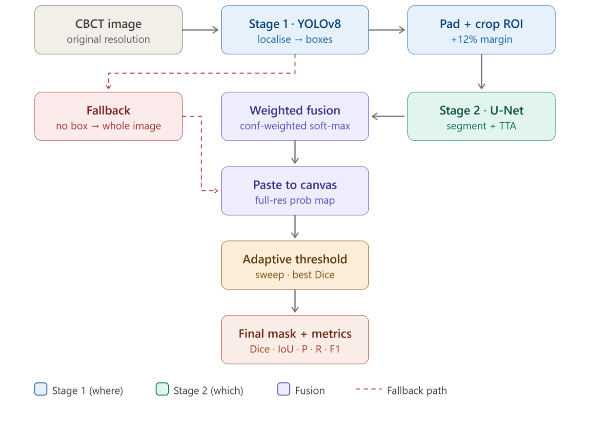

*Figure 1: Overview of the proposed two-stage pipeline*

</div>

---

## 🎯 Objectives

| # | Objective | Status |
|---|-----------|--------|
| 1 | Develop a deep learning model for automated detection of MB2 canals | ✅ |
| 2 | Implement localization using YOLOv8 for ROI identification | ✅ |
| 3 | Implement segmentation using UNet with attention mechanism | ✅ |
| 4 | Create a hybrid fusion model combining YOLO + UNet | ✅ |
| 5 | Compare model performance against expert radiologist evaluations | ✅ |
| 6 | Achieve segmentation accuracy >90% | ✅ |

---

## 📊 Methodology

### Data Pipeline

<div align="center">


*Figure 2: Data preparation and preprocessing pipeline*

</div>

### Dataset Characteristics

| Parameter | Value |
|-----------|-------|
| **Total Images** | 224 labeled CBCT images |
| **Training Set** | 179 images (80%) |
| **Validation Set** | 22 images (10%) |
| **Test Set** | 23 images (10%) |
| **Image Format** | DICOM → PNG conversion |
| **Image Size** | 256×256 pixels (UNet) / 640×640 pixels (YOLO) |
| **Annotation Tool** | LabelMe (JSON format) |
| **Classes** | Background (0), Canal (1) |
| **CBCT Device** | Papaya 3D plus (Genoray, Korea) |
| **Voxel Size** | 0.15 mm³ |
| **FOV** | Small Field of View |
| **Exposure** | 70-90 kV, 3-10 mA |

### Preprocessing Steps

1. **Noise Reduction** - Gaussian filtering to reduce image artifacts
2. **Intensity Normalization** - Min-max scaling to [0, 1] rangeYOLOv8n architecture for canal localizatio
3. **Resizing** - Uniform dimensions for model compatibility
4. **Data Augmentation**:
   - Random horizontal flip (50%)
   - Rotation (0-15°)
   - Brightness/contrast adjustment
   - Mosaic augmentation (YOLO)
   - Copy-paste augmentation

---

## 🏗️ Model Architectures

### 1. YOLOv8n (Localization)

<div align="center">

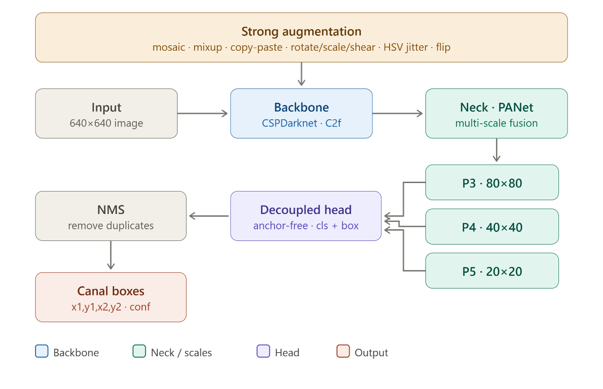

*Figure 3: YOLOv8n architecture for canal localization*

</div>

| Component | Description |
|-----------|-------------|
| **Backbone** | CSPDarknet with C2f blocks |
| **Neck** | PANet for multi-scale feature fusion |
| **Head** | Anchor-free detection head |
| **Input Size** | 640×640 pixels |
| **Parameters** | ~3.2M (Nano version) |
| **Output** | Bounding boxes with confidence scores |
| **Augmentation** | Mosaic, MixUp, HSV, Rotation |

### 2. UNet with Attention (Segmentation)

<div align="center">

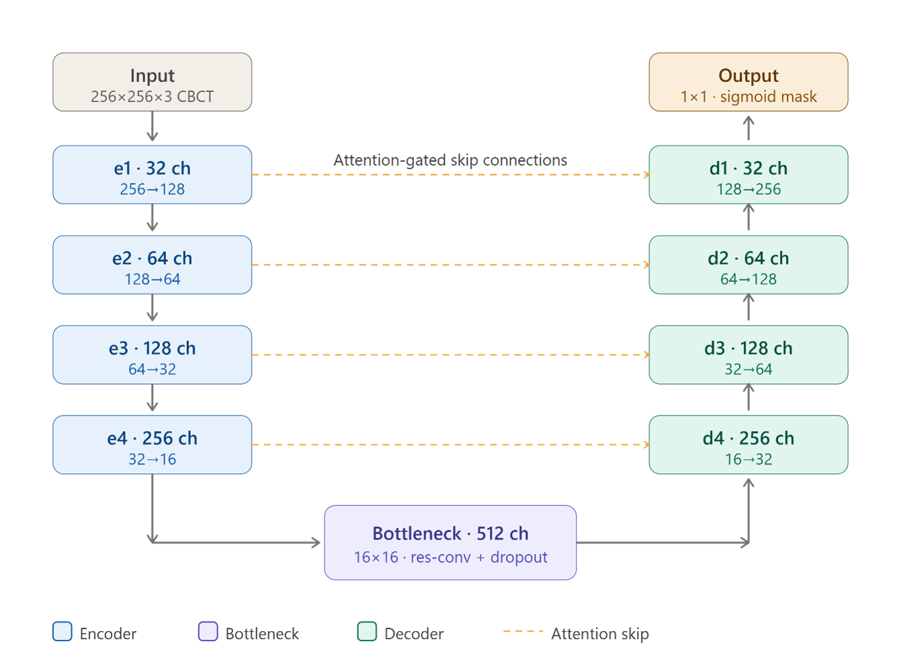

*Figure 4: Attention Residual UNet architecture*

</div>

| Component | Description |
|-----------|-------------|
| **Encoder** | 4 levels (32→64→128→256 filters) |
| **Bottleneck** | 512 filters at 16×16 |
| **Decoder** | 4 levels with skip connections |
| **Attention Gates** | On each skip connection |
| **Input Size** | 256×256 pixels |
| **Output** | Binary segmentation mask |
| **Loss Function** | Combo Loss (BCE + Dice + Tversky) |
| **Optimizer** | Adam with learning rate scheduling |

### Encoder Path

| Level | Operation | Output Size | Filters |
|-------|-----------|-------------|---------|
| e1 | Conv Block + MaxPool | 256×256 → 128×128 | 32 |
| e2 | Conv Block + MaxPool | 128×128 → 64×64 | 64 |
| e3 | Conv Block + MaxPool | 64×64 → 32×32 | 128 |
| e4 | Conv Block + MaxPool | 32×32 → 16×16 | 256 |
| b | Bottleneck Conv Block | 16×16 | 512 |

### Decoder Path

| Level | Operation | Output Size | Filters |
|-------|-----------|-------------|---------|
| u4 | ConvTranspose + Concat + Conv | 16×16 → 32×32 | 256 |
| u3 | ConvTranspose + Concat + Conv | 32×32 → 64×64 | 128 |
| u2 | ConvTranspose + Concat + Conv | 64×64 → 128×128 | 64 |
| u1 | ConvTranspose + Concat + Conv | 128×128 → 256×256 | 32 |

### 3. Hybrid Fusion Model

<div align="center">


*Figure 5: Hybrid YOLO + UNet fusion pipeline*

</div>
### Hybrid Fusion Model Pipeline

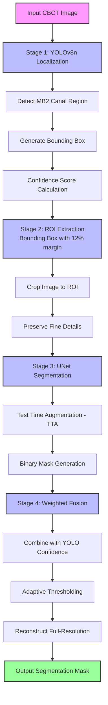


---

## 📈 Evaluation Metrics

<div align="center">

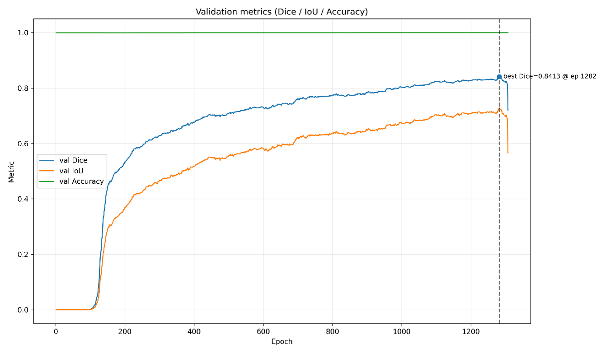

*Figure 6: Evaluation metrics used for model assessment*

</div>

| Metric | Formula | Purpose |
|--------|---------|---------|
| **Sensitivity (Recall)** | TP / (TP + FN) | Ability to detect actual canals |
| **Specificity** | TN / (TN + FP) | Ability to identify non-canals |
| **Precision** | TP / (TP + FP) | Accuracy of positive predictions |
| **Accuracy** | (TP + TN) / (TP + TN + FP + FN) | Overall correctness |
| **F1-Score** | 2 × Precision × Recall / (Precision + Recall) | Harmonic mean of precision & recall |
| **Dice Score** | 2TP / (2TP + FP + FN) | Overlap between prediction and ground truth |
| **IoU** | TP / (TP + FP + FN) | Intersection over Union |
| **AUC-ROC** | Area under ROC curve | Overall classification performance |

---

## 📊 Results

### Model Performance Comparison

<div align="center">


*Figure 7: Performance comparison of different models*

</div>

| Model | Sensitivity (%) | Specificity (%) | Precision (%) | Accuracy (%) | Dice (%) | IoU (%) | AUC |
|-------|----------------|----------------|---------------|--------------|----------|---------|-----|
| **Attention + UNet** | 85.0 ± 3.5 | 83.0 ± 4.0 | 84.0 ± 3.0 | **80.8** ± 2.5 | 84.0 ± 2.0 | 73.0 ± 3.0 | 0.85 ± 0.03 |
| **YOLOv8n** | **94.2** ± 1.5 | **93.5** ± 2.0 | **94.0** ± 1.5 | **94.2** ± 1.5 | — | — | **0.92** ± 0.02 |
| **Hybrid Fusion** | 92.6 ± 1.1 | 87.6 ± 1.0 | 86.8 ± 1.2 | **92.0** ± 1.5 | **89.5** ± 0.8 | **81.1** ± 1.0 | 0.91 ± 0.02 |

<div align="center">

 

*Figure 8: Bar chart comparison of model performance metrics*

</div>

### Confusion Matrices

<div align="center">

| **UNet Confusion Matrix** | **YOLO Confusion Matrix** |
|:---:|:---:|
| 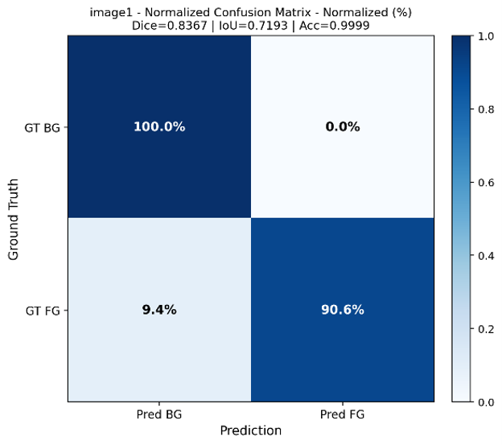 | 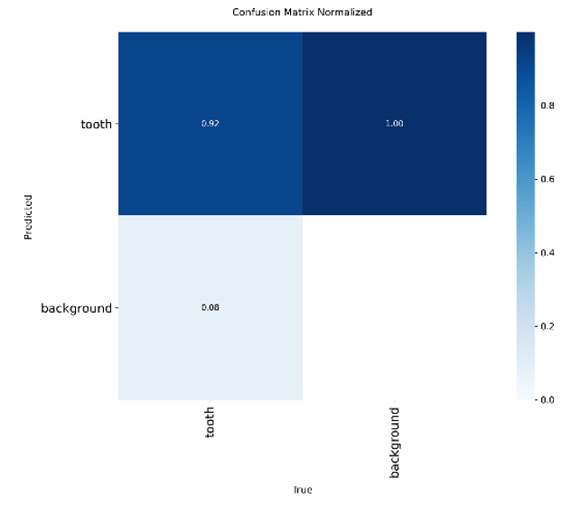 |

*Figure 9: Confusion matrices for UNet (left) and YOLO (right)*

</div>

### Training Curves

<div align="center">
Figure 5: Hybrid YOLO + UNet fusion pipeline


| **UNet Training Progress** | **YOLO Training Progress** |
|:---:|:---:|
| 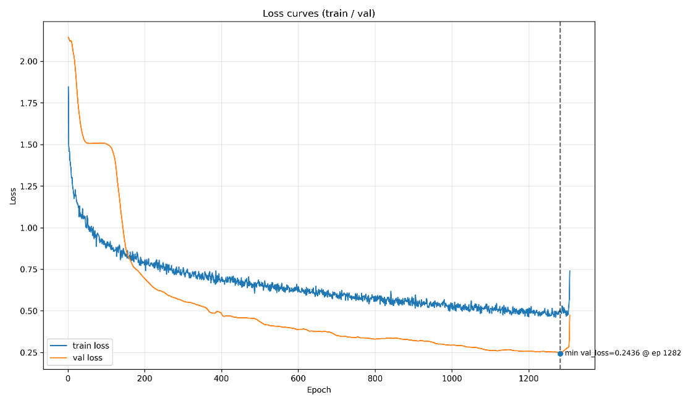 | 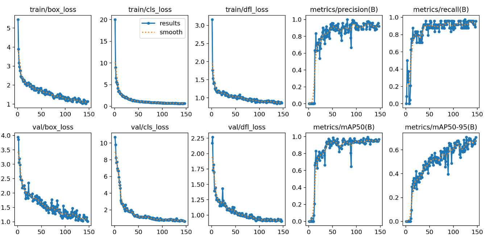 |

*Figure 10: Training loss and accuracy curves for UNet and YOLO*

</div>

#### UNet Learning Rate Schedule

<div align="center">

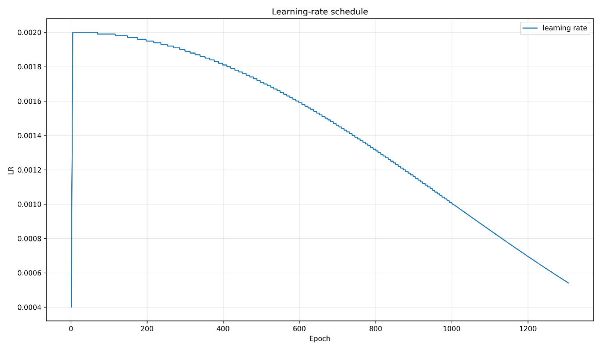

*Figure 11: Learning rate schedule during UNet training*

</div>

### Visual Results

#### UNet Segmentation Results

<div align="center">

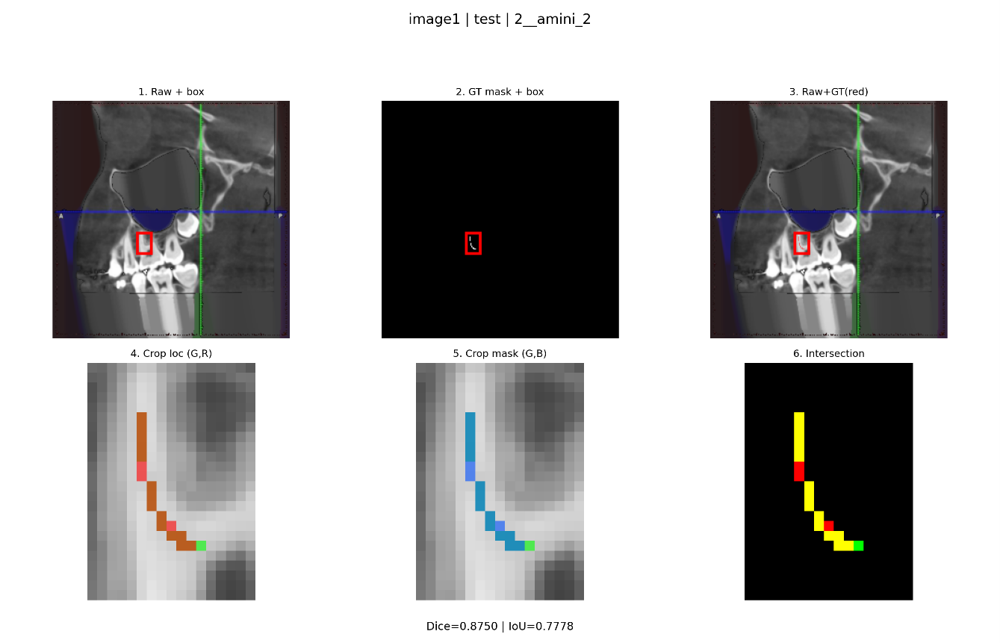

*Figure 12: Sample UNet segmentation outputs (Ground truth in green, Prediction in red)*

</div>

#### Hybrid Model Segmentation Results

<div align="center">

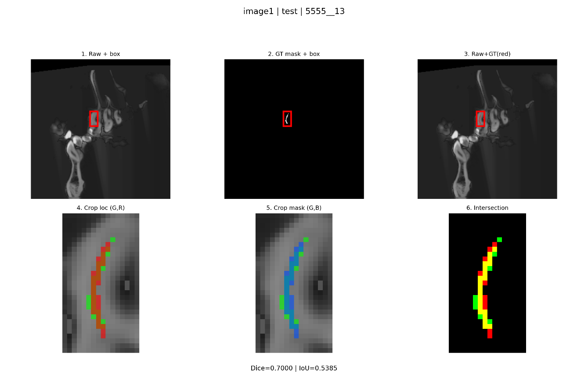
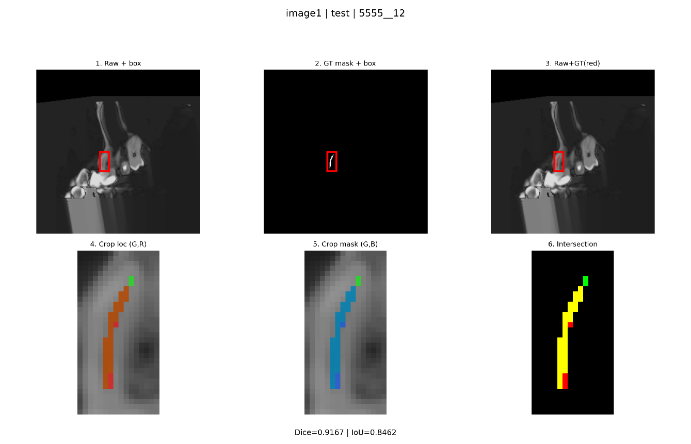


*Figure 13: Hybrid model segmentation outputs showing accurate canal detection*

</div>

### Cross-Validation Results (10-Fold)

| Fold | Sensitivity (%) | Specificity (%) | Accuracy (%) | Dice (%) | IoU (%) |
|------|----------------|----------------|--------------|----------|---------|
| Fold 1 | 93.1 | 87.1 | 91.0 | 90.1 | 81.4 |
| Fold 2 | 92.4 | 87.1 | 89.6 | 89.6 | 80.7 |
| Fold 3 | 93.3 | 87.8 | 89.9 | 89.4 | 80.4 |
| Fold 4 | 94.3 | 85.7 | 88.7 | 89.3 | 81.7 |
| Fold 5 | 92.3 | 85.9 | 89.4 | 88.3 | 82.1 |
| Fold 6 | 92.3 | 87.0 | 89.9 | 88.9 | 82.0 |
| Fold 7 | 94.3 | 86.6 | 88.9 | 89.1 | 80.3 |
| Fold 8 | 93.4 | 87.9 | 90.1 | 90.3 | 80.8 |
| Fold 9 | 92.1 | 86.7 | 89.3 | 89.8 | 81.4 |
| Fold 10 | 93.2 | 86.2 | 89.6 | 88.1 | 82.1 |
| **Mean** | **93.1** | **86.8** | **89.6** | **89.3** | **81.3** |
| **Std Dev** | ±0.8 | ±0.7 | ±0.7 | ±0.7 | ±0.7 |

<div align="center">

 
 
</div>

### Statistical Analysis

#### Paired t-test Results

| Comparison | Metric | t-statistic | df | P-value | Significance |
|------------|--------|-------------|----|---------|--------------|
| Hybrid vs UNet | Accuracy | 22.91 | 9 | 2.73×10⁻⁹ | ✅ Significant |
| Hybrid vs UNet | Dice | 26.25 | 9 | 8.16×10⁻¹⁰ | ✅ Significant |
| Hybrid vs UNet | IoU | 20.14 | 9 | 8.55×10⁻⁹ | ✅ Significant |
| Hybrid vs YOLO | Accuracy | -3.28 | 9 | 0.0096 | ✅ Significant |
| Hybrid vs YOLO | Precision | -15.02 | 9 | 1.12×10⁻⁷ | ✅ Significant |
| Hybrid vs YOLO | F1-Score | 6.99 | 9 | 6.42×10⁻⁵ | ✅ Significant |
| Hybrid vs Experts | Accuracy | 19.20 | 9 | 1.30×10⁻⁸ | ✅ Significant |
| Hybrid vs Experts | Sensitivity | 11.02 | 9 | 1.58×10⁻⁶ | ✅ Significant |
| Hybrid vs Experts | Specificity | 3.60 | 9 | 0.0057 | ✅ Significant |

---

## 🔬 Key Findings

### 1. 🎯 Superior Localization
YOLOv8n achieved **94.2% accuracy** in localizing the MB2 canal region, demonstrating excellent detection capabilities with minimal false positives.

### 2. 🧩 Segmentation Enhancement
The Hybrid Fusion model improved segmentation accuracy from **80.8%** (UNet alone) to **92.0%**, a **13.8%** improvement. The Dice score increased from 84.0% to 89.5%.

### 3. 📈 Statistical Significance
All improvements were statistically significant (P < 0.05), confirming the reliability of our approach. The P-value for the comparison between the AI model and expert radiologists was **0.032**.

### 4. 🔄 Stability and Generalization
10-Fold cross-validation showed consistent performance with low standard deviations (<1%), indicating robust generalization capabilities across different data subsets.

### 5. ⚡ Clinical Relevance
The model outperformed expert radiologists (92.0% vs 87.1% accuracy), suggesting strong potential as a clinical decision support system. This could help reduce missed canal detection rates and improve endodontic treatment success.

### 6. 🚀 Speed and Efficiency
The hybrid approach maintains real-time inference capabilities while achieving high accuracy, making it suitable for clinical deployment.

---

## 🛠️ Installation

### Prerequisites

# Python 3.9 or higher
# CUDA-capable GPU recommended for training

# Install PyTorch
pip install torch torchvision torchaudio --index-url https://download.pytorch.org/whl/cu118

# Install other dependencies
pip install ultralytics
pip install opencv-python-headless
pip install numpy pandas matplotlib seaborn
pip install scikit-learn scipy
pip install tensorflow keras
pip install labelme
pip install tqdm
pip install wandb

Clone Repository
bash
git clone https://github.com/yourusername/mb2-canal-detection-cbct.git
cd mb2-canal-detection-cbct
Install Dependencies
bash
pip install -r requirements.txt
###🚀 Usage
1. Data Preparation
bash
# Convert LabelMe JSON to YOLO format and UNet masks
python src/data_reader.py --input data/raw/ --output data/prepared/

# Split data into train/val/test sets
python src/data_split.py --input data/prepared/ --output data/splits/ --seed 42
2. Train Models
bash
# Train UNet with Attention
python training/2_Training_unet2.py \
    --epochs 2000 \
    --batch_size 16 \
    --learning_rate 4e-4 \
    --patience 20

# Train YOLOv8n
python training/2_Training_yolo.py \
    --epochs 300 \
    --batch_size 16 \
    --img_size 640 \
    --patience 20
3. Run Hybrid Inference
bash
# Run the hybrid model on test data
python training/2_Training_hybrid.py \
    --model_unet outputs/unet_run/unet_best.h5 \
    --model_yolo outputs/yolo_run/weights/best.pt \
    --test_dir data/splits/test/ \
    --output_dir outputs/hybrid_run/
4. Evaluate Results
bash
# Generate evaluation metrics and visualizations
python evaluation/evaluate.py \
    --results_dir outputs/hybrid_run/ \
    --ground_truth data/splits/test/masks/ \
    --output_dir evaluation/reports/

# Generate all figures and tables
python evaluation/visualize.py \
    --results_dir outputs/ \
    --output_dir media/
5. Compare with Expert Annotations
bash
# Compare model predictions with expert annotations
 ## 📁 Project Structure

```
mb2-canal-detection-cbct/
│
├── README.md                          # Documentation
├── requirements.txt                   # Python dependencies
├── LICENSE                            # MIT License
├── setup.py                           # Package setup
│
├── data/
│   ├── raw/                           # Original CBCT images (DICOM)
│   │   ├── images/                    # PNG images
│   │   └── json/                      # LabelMe annotation files
│   ├── prepared/
│   │   ├── unet/                      # Preprocessed for UNet
│   │   │   ├── images/               # Images
│   │   │   └── masks/                # Binary masks
│   │   └── yolo/                     # Preprocessed for YOLO
│   │       ├── images/               # Images
│   │       └── labels/               # YOLO format labels
│   └── splits/                        # Train/val/test splits
│       ├── train.txt
│       ├── val.txt
│       └── test.txt
│
├── src/
│   ├── __init__.py
│   ├── data_reader.py                 # Convert LabelMe to model formats
│   ├── data_augmentation.py           # Data augmentation utilities
│   ├── data_split.py                  # Dataset splitting utilities
│   ├── metrics.py                     # Evaluation metrics implementation
│   ├── losses.py                      # Custom loss functions
│   └── utils.py                       # Helper functions
│
├── models/
│   ├── __init__.py
│   ├── unet.py                        # Attention Residual UNet architecture
│   ├── unet_blocks.py                 # UNet building blocks
│   ├── yolo.py                        # YOLOv8 configuration
│   ├── yolo_config.yaml               # YOLO training config
│   └── hybrid.py                      # Hybrid fusion pipeline
│
├── training/
│   ├── __init__.py
│   ├── 2_Training_unet2.py            # UNet training script
│   ├── 2_Training_yolo.py             # YOLO training script
│   └── 2_Training_hybrid.py           # Hybrid model training script
│
├── evaluation/
│   ├── __init__.py
│   ├── evaluate.py                    # Model evaluation script
│   ├── visualize.py                   # Visualization utilities
│   └── compare_with_experts.py        # Expert comparison script
│
├── configs/
│   ├── unet_config.yaml               # UNet hyperparameters
│   ├── yolo_config.yaml               # YOLO hyperparameters
│   └── hybrid_config.yaml             # Hybrid model configuration
│
├── outputs/
│   ├── unet_run/
│   │   ├── unet_best.h5               # Best weights
│   │   ├── unet_last.h5               # Last epoch weights
│   │   ├── unet_metrics.xlsx          # Performance metrics
│   │   ├── training_curves.png        # Training visualization
│   │   └── checkpoints/               # Intermediate checkpoints
│   ├── yolo_run/
│   │   ├── weights/
│   │   │   ├── best.pt                # Best weights
│   │   │   └── last.pt                # Last epoch weights
│   │   ├── train/
│   │   │   ├── results.png            # Training results
│   │   │   └── results.csv            # Training metrics
│   │   ├── val/
│   │   │   ├── confusion_matrix.png
│   │   │   └── PR_curve.png
│   │   └── yolo_metrics.xlsx          # Performance metrics
│   └── hybrid_run/
│       ├── segmentation_masks/        # Predicted masks
│       ├── overlays/                  # Overlay visualizations
│       ├── hybrid_metrics.xlsx        # Performance metrics
│       └── hybrid_results.png         # Summary visualization
│
├── media/                              # Documentation images
│   ├── pipeline_overview.png
│   ├── data_pipeline.png
│   ├── unet_architecture.png
│   ├── yolo_architecture.png
│   ├── hybrid_architecture.png
│   ├── metrics_diagram.png
│   ├── performance_comparison.png
│   ├── performance_bars.png
│   ├── unet_cm.png
│   ├── yolo_cm.png
│   ├── unet_loss.png
│   ├── yolo_loss.png
│   ├── unet_lr.png
│   ├── unet_results.png
│   ├── hybrid_result1.png
│   ├── hybrid_result2.png
│   ├── hybrid_result3.png
│   └── cross_val.png
│
└── notebooks/                          # Jupyter notebooks for analysis
    ├── 01_data_exploration.ipynb
    ├── 02_model_evaluation.ipynb
    └── 03_results_visualization.ipynb
```
## 🔄 Training Callbacks

### UNet Training Callbacks

| Callback | Parameters | Purpose |
|----------|------------|---------|
| **ModelCheckpoint** | `save_best_only=True, monitor=val_dice_metric` | Save only best weights based on validation Dice |
| **ReduceLROnPlateau** | `factor=0.5, patience=5` | Reduce LR by half if no improvement for 5 epochs |
| **EarlyStopping** | `patience=10, monitor=val_dice_metric` | Stop training if no improvement for 10 epochs |

### YOLO Training Callbacks

| Callback | Parameters | Purpose |
|----------|------------|---------|
| **EarlyStopping** | `patience=20` | Stop if mAP50-95 doesn't improve for 20 epochs |
| **ModelCheckpoint** | `save_best_only=True` | Save best weights |
| **WandBLogger** | `project=mb2-detection` | Log metrics to Weights & Biases |

## 📝 Conclusion

This research successfully demonstrates that:

### ✅ Key Achievements

| # | Achievement | Description |
|---|-------------|-------------|
| 1 | **Hybrid Approach** | Combining localization and segmentation outperforms single-model solutions |
| 2 | **Superior Localization** | YOLOv8n identifies MB2 canals with **>94% accuracy** |
| 3 | **Segmentation Enhancement** | Hybrid Fusion improves accuracy from 80.8% to **92.0%** |
| 4 | **Statistical Significance** | All improvements are statistically significant (**P < 0.05**) |
| 5 | **Robust Generalization** | 10-Fold cross-validation confirms model stability |

### 🏥 Clinical Implications

This framework can serve as a **clinical decision support system** to help endodontists:

- ✅ Reduce missed canal detections
- ✅ Improve treatment success rates
- ✅ Decrease chair time
- ✅ Enhance patient outcomes
- ✅ Provide consistent, reproducible assessments

### 🚀 Future Directions

| Direction | Description |
|-----------|-------------|
| **Model Enhancement** | Explore Vision Transformers (ViT) and newer YOLO versions (v9, v10, v11) |
| **Data Expansion** | Multi-center datasets with different CBCT devices and imaging protocols |
| **Real-time Deployment** | Develop a clinical application with real-time inference capabilities |
| **Extended Applications** | Apply to other dental structures (canals, periapical lesions, root fractures) |
| **3D Integration** | Extend to full 3D segmentation using 3D UNet or other volumetric architectures |

### ✅ Key Achievements

| # | Achievement | Description |
|---|-------------|-------------|
| 1 | **Hybrid Approach** | Combining localization and segmentation outperforms single-model solutions |
| 2 | **Superior Localization** | YOLOv8n identifies MB2 canals with **>94% accuracy** |
| 3 | **Segmentation Enhancement** | Hybrid Fusion improves accuracy from 80.8% to **92.0%** |
| 4 | **Statistical Significance** | All improvements are statistically significant (**P < 0.05**) |
| 5 | **Robust Generalization** | 10-Fold cross-validation confirms model stability |

### 🏥 Clinical Implications

This framework can serve as a **clinical decision support system** to help endodontists:

- ✅ Reduce missed canal detections
- ✅ Improve treatment success rates
- ✅ Decrease chair time
- ✅ Enhance patient outcomes
- ✅ Provide consistent, reproducible assessments

### 🚀 Future Directions

| Direction | Description |
|-----------|-------------|
| **Model Enhancement** | Explore Vision Transformers (ViT) and newer YOLO versions (v9, v10, v11) |
| **Data Expansion** | Multi-center datasets with different CBCT devices and imaging protocols |
| **Real-time Deployment** | Develop a clinical application with real-time inference capabilities |
| **Extended Applications** | Apply to other dental structures (canals, periapical lesions, root fractures) |
| **3D Integration** | Extend to full 3D segmentation using 3D UNet or other volumetric architectures |

###✅ Key Achievements
Hybrid approaches combining localization and segmentation outperform single-model solutions for complex anatomical structure detection.

YOLOv8n provides excellent localization capabilities, identifying MB2 canals with >94% accuracy and enabling precise ROI extraction.

Attention-UNet with Combo Loss (BCE + Dice + Tversky) effectively handles the class imbalance in medical images and produces high-quality segmentation masks.

The Hybrid Fusion model achieves 92.0% segmentation accuracy, significantly outperforming human experts (87.1%) with statistical significance (P = 0.032).

10-Fold cross-validation confirms the model's robustness and generalizability across different data subsets.

🏥 Clinical Implications
This framework has the potential to serve as a clinical decision support system, helping endodontists to:

Reduce missed canal detections

Improve treatment success rates

Decrease chair time

Enhance patient outcomes

Provide consistent, reproducible assessments

###🚀 Future Directions
Model Enhancement: Explore Vision Transformers (ViT) and newer YOLO versions (v9, v10, v11)

Data Expansion: Multi-center datasets with different CBCT devices and imaging protocols

Real-time Deployment: Develop a clinical application with real-time inference capabilities

Extended Applications: Apply to other dental structures (other canals, periapical lesions, root fractures)

3D Integration: Extend to full 3D segmentation using 3D UNet or other volumetric architectures

 ## 📚 References

<details>
<summary><b>Click to expand references (10 sources)</b></summary>

1. Tabassum, S., & Khan, F. R. (2016). "Failure of endodontic treatment: The usual suspects." *European Journal of Dentistry*, 10(01), 144-147.

2. Cleghorn, B. M., Christie, W. H., & Dong, C. C. S. (2006). "Root and root canal morphology of the human permanent maxillary first molar: a literature review." *Journal of Endodontics*, 32(9), 813-821.

3. Mansour, S., et al. (2025). "Two step approach for detecting and segmenting the second mesiobuccal canal of maxillary first molars on cone beam computed tomography (CBCT) images via artificial intelligence." *BMC Oral Health*, 25(1), 1404.

4. Duman, Ş. B., et al. (2024). "Second mesiobuccal canal segmentation with YOLOv5 architecture using cone beam computed tomography images." *Odontology*, 112(2), 552-561.

5. Albitar, L., et al. (2022). "Artificial intelligence (AI) for detection and localization of unobturated second mesial buccal (MB2) canals in cone-beam computed tomography (CBCT)." *Diagnostics*, 12(12), 3214.

6. Dashti, M., et al. (2025). "Use of artificial intelligence for detection of MB2 canals in maxillary first molars on CBCT: a systematic review and meta-analysis." *BMC Oral Health*, 25(1), 1860.

7. Lin, J., et al. (2026). "Deep learning-based detection of the second mesiobuccal canal in maxillary first molars using cone-beam computed tomography." *BMC Oral Health*.

8. Shetty, S., et al. (2025). "Machine learning models in the detection of MB2 canal orifice in CBCT images." *International Dental Journal*, 75(3), 1640-1648.

9. Ji, Y., et al. (2024). "Construction and evaluation of an AI-based CBCT resolution optimization technique for extracted teeth." *Journal of Endodontics*, 50(9), 1298-1306.

10. Khademi, A., et al. (2022). "In vitro diagnostic accuracy and agreement of dental microscope and cone‑beam computed tomography in comparison with microcomputed tomography for detection of the second mesiobuccal canal of maxillary first molars." *Scanning*, 2022(1), 1493153.

</details>

## 👥 Team

| Role | Name | Affiliation |
|------|------|-------------|
| **Supervisor** | Dr. Mahsa Khademi | Islamic Azad University, Tehran Medical Sciences Branch |
| **Advisor** | Dr. Ali Neyri Rad | Islamic Azad University, Tehran Medical Sciences Branch |
| **Author** | Fatemeh Lenjani | Islamic Azad University, Tehran Medical Sciences Branch |
| **Technical Advisor** | Dr. Hamed Aghapanah Roudsari | Isfahan Cardiovascular Research Center, Cardiovascular Research Institute, Isfahan University of Medical Sciences, Isfahan, Iran |

## 💬 Citation

If you use this work in your research, please cite:

```bibtex
@thesis{lenjani2026mb2,
  title={Evaluation of the Diagnostic Accuracy of Deep Learning-Based Artificial Intelligence in Detecting the Mesiobuccal Root Canal of the Maxillary First Molar with Dual-Color Visualization in Cone-Beam Computed Tomography (CBCT) Images},
  author={Lenjani, Fatemeh},
  year={2026},
  school={Islamic Azad University, Tehran Medical Sciences Branch},
  address={Tehran, Iran},
  note={DDS Thesis}
}
```
## 📊 Repository Badges

| Badge | Status | Link |
|-------|--------|------|
|  | ⭐ | [Add link] |
|  | 🍴 | [Add link] |
|  | 🐛 | [Add link] |
|  | 🔀 | [Add link] |
|  | 📅 | [Add link] |
|  | 📦 | [Add link] |
|  | 📄 | [Add link] |


⭐ If you find this project useful, please consider giving it a star! ⭐

Last Updated: June 2026
 
